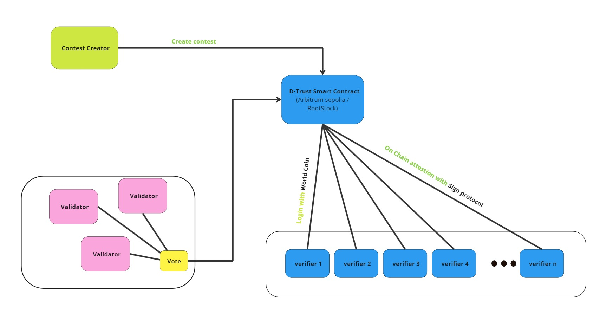

# D-Trust

Decentralizing the Truth to Combat Censorship and Misinformation

## Why?

In an era where misinformation spreads faster than facts and censorship stifles diverse voices, the truth has become a contested commodity. Traditional fact-checking mechanisms are often centralized, vulnerable to biases, and limited by geopolitical or financial influences. But what if there was a way to democratize the process of fact-checking, putting the power back into the hands of the people? Enter D-Trust—a decentralized platform leveraging blockchain technology to create a transparent, censorship-resistant environment for validating real-world events and information.

The Problem: Centralized Truth in a Decentralized World

Misinformation and censorship are not just buzzwords; they are critical issues undermining trust in media, governance, and even science. Platforms that control the flow of information can manipulate narratives, suppress dissenting voices, and prioritize profit over the public good. As a result, the public's ability to discern truth from falsehood diminishes, leading to polarized societies and misinformed decisions.

Traditional fact-checking organizations, while essential, often face questions about their impartiality and reach. Their centralized nature makes them susceptible to external pressures and biases, further complicating the quest for a universally accepted truth. The need for a decentralized solution has never been more urgent.

## How D-Trust Works: Trustless Verification, Collective Accountability

1. Claim submissons with bounties
2. Decentralized Voting
3. Proof Validation
4. Outcome and Incentives

### Architecture

### Tech Stack

1. World Coin - To verify uniquness & humanness for fair voting

2. RootStock - To Deploy the verification game smart contract
   Contracts Deployed:
   D-Trust : 0xFe9c4fA65f3A0Da7Ac2D399F52E77a67ac5a244E
   D-TrustToken: 0x870d1d8665588513afFe26B446385ffa4ec8eeC2
3. Scaffold Eth - To bootstrap a full Stack DApp
4. Sign Protocol - To create omnichain attestations for Validator flow
   Deployments on Arbitrum Sepolia:
   Hook Contract: 0x7C59A82Cce072c72edbcc11Ef4B78bc98F0a7FF1
   Schema Link: https://testnet-scan.sign.global/schema/onchain_evm_421614_0xfe
5. IPFS - To store data in a decentralized fashion

## Instructions

1. Sign-in using WorldCoin prove your unique humanness.

2) Create a new Bounty to get any facts verifed by calling the D-Trust-Hook smart contract deployed on RootStock & Arbitrum Sepolia.

3) Define a Sign Schema for attestation, specify threshold for quorom of votes, time limit for community to provide attestations/ votes.

4) Verify & Vote to earn bounties. The users then upload proofs to ipfs & create attestation directed towards the D-Trust-Hook smart contract.
5) Once a quorum is reached the bounty is distributed evenly between the winners.

6) request refund of bounties whose quorum for successful verification is not reached within the specified time limit.

### contracts

The contracts are stored in the packages/hardhat/contracts directory

1. `cd packages/hardhat/contracts`
2. `dtrust.sol` is the simple smart contract which handles simple verification game of votes logic.
3. `dtrust-vote-hook.sol` is the ISP-HOOK contract used by Sign protocol to sign onchain attestations.
4. `dtrusttoken.sol` is a simple ERC20 token that will be used as the base currency for conducting bounties on the platform.

### frontend

The frontend code is located in the packages/nextjs folder with a lots of bootstrap components

1. `cp .env.sample .env` fill the various secrets required by WorldCoin , Pinata , Arbitrum, Rootstock , Sign

2) `yarn && yarn start` to run the DApp in development mode.

## Demo

[Pitch Deck](https://www.canva.com/design/DAGRSZYdevo/4tTjWr_yYa9UGEduxgS9Xw/edit?utm_content=DAGRSZYdevo&utm_campaign=designshare&utm_medium=link2&utm_source=sharebutton)

## Future steps

- AI-Agent based Validation
- validator pools implementation
- Mobile App for verified real world events
- gasless model for users
- sound revenue model for independent validators
- on-chain reputation ui/ux
