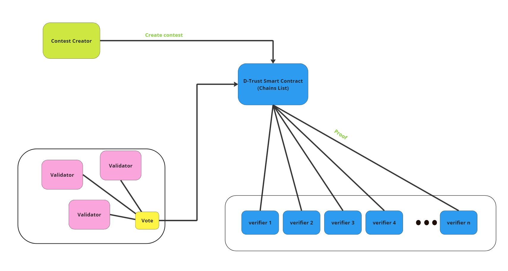

# D-Trust

Decentralizing the Truth to Combat Censorship and Misinformation

## Why?

In an era where misinformation spreads faster than facts and censorship stifles diverse voices, the truth has become a contested commodity. Traditional fact-checking mechanisms are often centralized, vulnerable to biases, and limited by geopolitical or financial influences. But what if there was a way to democratize the process of fact-checking, putting the power back into the hands of the people? Enter D-Trust—a decentralized platform leveraging blockchain technology to create a transparent, censorship-resistant environment for validating real-world events and information.

The Problem: Centralized Truth in a Decentralized World

Misinformation and censorship are not just buzzwords; they are critical issues undermining trust in media, governance, and even science. Platforms that control the flow of information can manipulate narratives, suppress dissenting voices, and prioritize profit over the public good. As a result, the public's ability to discern truth from falsehood diminishes, leading to polarized societies and misinformed decisions.

Traditional fact-checking organizations, while essential, often face questions about their impartiality and reach. Their centralized nature makes them susceptible to external pressures and biases, further complicating the quest for a universally accepted truth. The need for a decentralized solution has never been more urgent.

## How D-Trust Works: Trustless Verification, Collective Accountability

1. Claim submissons with bounties
2. Decentralized Voting
3. Proof Validation
4. Outcome and Incentives

### Architecture



### Tech Stack used

## Instructions

### contracts

```
yarn deploy
```

### frontend

```
   cp .env.sample .env`
   cd packages/nextjs
   yarn
   yarn start
```

## Future steps

## Demo
